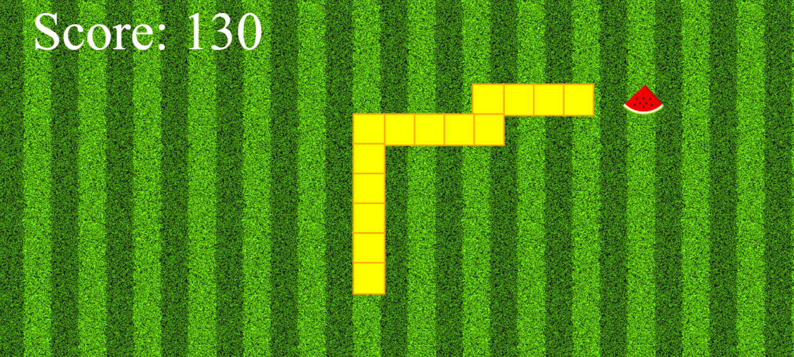
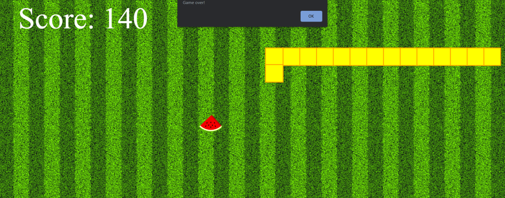

# Snake Game in JS
This is the javascript version of the classic Snake Game in which the snake has to eat tasty watermelons to gain points!   
The snake must not touch the outline of the screen, on doing so, the game ends. 
Load the page to play again.  
This is an infinite game, so play till you can! 

# In Action:
These is the main page:

When the snake/array hits the outline of the page, the game ends:

# Authors:
Srinidhi Ayyagari

# Acknowledgement:
Would like to thank Prateek bhaiya, Arnav bhaiya and all the resources on Youtube and Stack Overflow always! :)

# A Small Catch:
The game does not end when the snake hits itself.  
This part is yet to be developed.  

